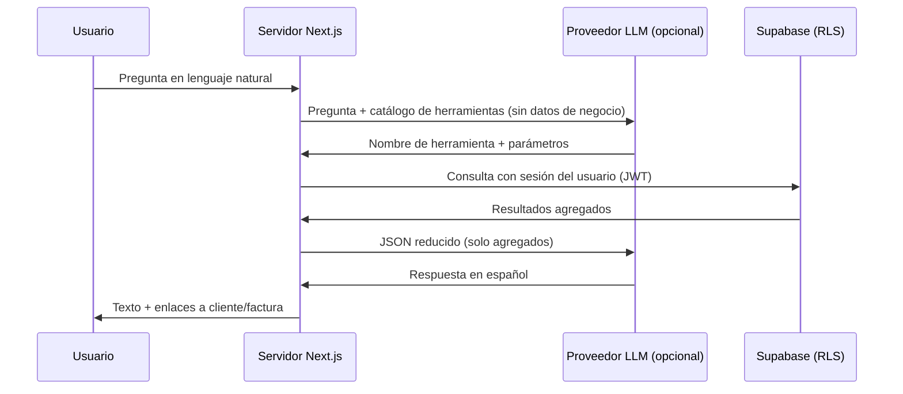

# Asistente de facturación con IA

Documento de referencia para la memoria del TFG. Describe el diseño, la privacidad de datos y el despliegue del módulo **Asistente** (`/asistente`) de la aplicación *tfg-facturacion-ia*.

---

## 1. Objetivo

Permitir al usuario del panel hacer **preguntas en lenguaje natural** sobre su actividad de facturación, por ejemplo:

- ¿Qué cliente me debe más dinero?
- ¿Cuántas facturas tiene [nombre de cliente]?
- ¿Cuál es la última factura emitida de [cliente]?
- Resume mi facturación de este mes o del trimestre.
- ¿Qué facturas están vencidas?

El asistente **no sustituye** al gestor de facturas (crear, emitir, anular): solo **consulta y resume** información ya almacenada en la base de datos del usuario.

---

## 2. Principio de diseño: la IA no accede a la base de datos

El problema central de un asistente en un sistema con **datos sensibles** (facturas, clientes, importes, identificadores fiscales) es evitar que un modelo de lenguaje externo reciba más información de la necesaria o que tenga acceso directo al almacenamiento.

La solución adoptada sigue el patrón **tool calling** (también llamado *function calling*):



**Conclusión:** el modelo de lenguaje actúa como **intérprete de la intención** y, opcionalmente, como **redactor** de la respuesta. Los **datos de negocio** los obtiene siempre el **servidor de la aplicación**, con las mismas reglas de seguridad que el resto del panel (Row Level Security en Supabase).

---

## 3. Minimización de datos enviados al proveedor de IA

### 3.1. Qué no se envía nunca al LLM

| Dato | Motivo |
|------|--------|
| NIF / CIF / DNI del cliente o emisor | Dato fiscal identificativo; no necesario para responder preguntas agregadas |
| Dirección fiscal completa | Dato personal / fiscal |
| Email y teléfono del cliente | No aportan a las consultas previstas |
| Líneas detalladas de factura (conceptos, cantidades internas) | Exceso de detalle; riesgo innecesario |
| Claves internas masivas | Se usan solo en el servidor para construir enlaces en la UI |

### 3.2. Qué sí puede enviarse (agregados)

Tras ejecutar una herramienta en el servidor, el JSON que puede llegar al LLM para redactar la respuesta contiene, por ejemplo:

```json
{
  "clientName": "Acme SL",
  "pendingEur": 2400.5,
  "openInvoiceCount": 3,
  "lastInvoice": {
    "numberLabel": "A-2026/042",
    "issueDate": "2026-05-10",
    "totalEur": 450,
    "status": "Parcialmente pagada"
  }
}
```

El usuario ya conoce los nombres comerciales de sus clientes; el riesgo adicional de incluir el **nombre comercial** en el payload al proveedor se considera aceptable frente al beneficio de respuestas naturales. Los **identificadores fiscales** quedan excluidos de forma explícita.

### 3.3. Modo sin proveedor externo

Si no se configura `OPENAI_API_KEY`, el asistente funciona en **modo local**:

1. Reglas y expresiones regulares interpretan la pregunta (`match-intent`).
2. Se ejecuta la misma herramienta en el servidor.
3. La respuesta se genera con **plantillas en español** (`formatToolResultAsText`), sin llamada a ningún API externo.

Así la funcionalidad es demostrable en entornos sin clave de IA o con requisitos estrictos de no subcontratar el tratamiento de datos.

---

## 4. Catálogo de herramientas (whitelist)

Solo existen las operaciones definidas en código. El modelo no puede inventar consultas SQL ni acceder a tablas arbitrarias.

| Herramienta | Descripción | Ejemplos de pregunta |
|-------------|-------------|----------------------|
| `get_top_debtors` | Clientes con mayor importe pendiente de cobro | «¿Quién me debe más?» |
| `get_client_summary` | Número de facturas y deuda pendiente de un cliente | «¿Cuánto debe Acme?» |
| `get_client_last_invoice` | Última factura emitida de un cliente | «Última factura de [cliente]» |
| `search_invoices` | Listado filtrado por cliente y/o estado | «Facturas vencidas de X» |
| `get_billing_summary` | Resumen de facturación y cobros en un periodo | «Resume el trimestre» |
| `list_clients` | Listado de clientes (opcionalmente por texto) | «Mis clientes que se llamen…» |

Cada herramienta devuelve un objeto JSON acotado y, en paralelo, **enlaces** (`/clients/{id}`, `/invoices/{id}`) que la interfaz muestra como botones.

La resolución de nombres de cliente (p. ej. «Acme» frente a «Acme SL») se hace en el servidor mediante búsqueda por similitud sobre el listado del tenant. Si hay ambigüedad, se devuelve la lista de candidatos y se pide al usuario que precise el nombre.

---

## 5. Seguridad y aislamiento multiusuario

- Las consultas usan el cliente Supabase del **servidor** con la **cookie de sesión** del usuario autenticado.
- Las políticas **RLS** (`user_id` por fila) garantizan que un usuario solo ve sus clientes y facturas.
- No hay tokens de API públicos para el asistente: el acceso pasa por el mismo login que el resto del panel (`/login`).
- Las acciones destructivas (emitir, borrar, modificar) **no** están expuestas como herramientas del asistente en la versión actual.

---

## 6. Arquitectura de software

### 6.1. Ubicación en el proyecto

| Componente | Ruta |
|------------|------|
| Página del asistente | `src/app/asistente/page.tsx` |
| Interfaz de chat | `src/components/assistant-panel.tsx` |
| Server Action | `src/app/actions/assistant.ts` |
| Orquestación | `src/lib/assistant/ask.ts` |
| Carga de contexto (facturas, clientes, pagos) | `src/lib/assistant/context.ts` |
| Implementación de herramientas | `src/lib/assistant/tools.ts` |
| Intención sin LLM | `src/lib/assistant/match-intent.ts` |
| Integración OpenAI | `src/lib/assistant/openai.ts` |
| Esquemas para function calling | `src/lib/assistant/tool-schemas.ts` |

### 6.2. Flujo de una pregunta

1. El usuario envía el texto desde el formulario (Server Action `assistantAskAction`).
2. `askAssistant` carga el contexto del tenant (`loadAssistantContext`).
3. Se intenta resolver la intención con **reglas locales** (`matchAssistantIntent`).
4. Si no hay coincidencia y existe `OPENAI_API_KEY`, se llama a **OpenAI** para elegir herramienta y argumentos (`pickToolWithOpenAI`).
5. Se ejecuta la herramienta (`executeAssistantTool`).
6. La respuesta se formatea con plantillas; si hay API key y no está `ASSISTANT_SKIP_POLISH=1`, opcionalmente se **redacta** con un segundo llamado al LLM usando solo el JSON del paso 5 (`polishAnswerWithOpenAI`).
7. Se devuelve texto + enlaces a la UI.

### 6.3. Relación con el módulo de informes

En **Informes** existe un panel «Preguntas rápidas (IA)» que utiliza **reglas fijas** sobre los datos del informe (`reports-insight.ts`). El **Asistente** generaliza el enfoque a toda la aplicación, añade más herramientas y, de forma opcional, enrutado y redacción mediante un LLM.

---

## 7. Configuración y despliegue

### 7.1. Variables de entorno

| Variable | Obligatoria | Descripción |
|----------|-------------|-------------|
| `OPENAI_API_KEY` | No | Si está definida, enrutado de preguntas ambiguas y redacción de respuestas |
| `OPENAI_MODEL` | No | Por defecto `gpt-4o-mini` |
| `ASSISTANT_SKIP_POLISH` | No | Si vale `1`, no se llama al LLM para redactar (solo plantillas) |

Las variables de Supabase (`NEXT_PUBLIC_SUPABASE_URL`, `NEXT_PUBLIC_SUPABASE_ANON_KEY`) son las mismas que para el resto de la aplicación.

### 7.2. Despliegue en Vercel

Añadir las variables en **Settings → Environment Variables** y redeploy. La ruta `/asistente` queda protegida por el middleware de autenticación igual que el resto del panel.

Documentación operativa ampliada: `VERCEL.md` y `.env.local.example`.

---

## 8. Limitaciones conocidas (v1)

- El historial del chat es **solo en memoria del navegador** (se pierde al recargar).
- No se pueden crear ni modificar facturas desde el asistente.
- La extracción del nombre de cliente en modo local depende de patrones de texto; preguntas muy ambiguas pueden requerir reformular o usar OpenAI.
- El proveedor LLM, si se usa, queda sujeto a sus condiciones de tratamiento de datos; en la memoria conviene citar la política de OpenAI (o el proveedor elegido) y justificar la minimización descrita en el apartado 3.

---

## 9. Posibles extensiones futuras

- Persistencia del historial de conversación en base de datos.
- Nuevas herramientas de solo lectura (productos más vendidos, comparativa año anterior).
- Integración **n8n** reutilizando las mismas funciones de herramientas vía API interna o MCP, sin exponer datos sensibles al modelo.
- Acciones con confirmación explícita del usuario (p. ej. «crear borrador») en una fase posterior, siempre con validación en servidor.

---

## 10. Resumen para la defensa oral

> El asistente no «ve» la base de datos ni maneja DNIs. El servidor ejecuta consultas acotadas con la sesión del usuario; el modelo de lenguaje, si se usa, solo elige qué consulta hacer y redacta la respuesta a partir de agregados. Sin clave de OpenAI, el sistema sigue funcionando con reglas locales, lo que demuestra que la lógica de negocio no depende del proveedor externo.

---

*Versión del documento alineada con el commit que introduce `/asistente` y el módulo `src/lib/assistant/`.*
