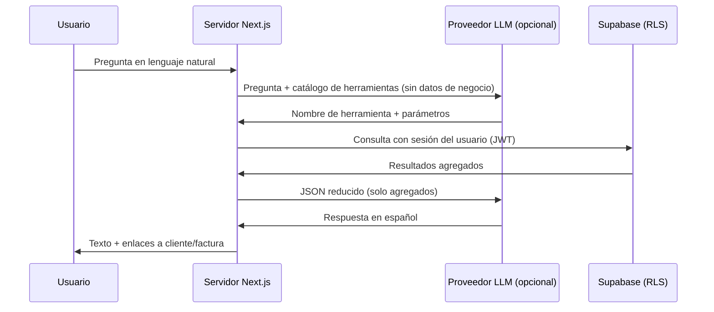

# Asistente de facturación con IA (copilot)

Documento de referencia para la memoria del TFG. Describe el diseño, la privacidad de datos, la experiencia de usuario tipo **copilot** y el despliegue del módulo **Asistente** de la aplicación *tfg-facturacion-ia*.

El asistente no es solo una página de chat: está integrado en toda la aplicación como **atajo operativo** para consultar datos y abrir vistas filtradas con menos clics.

---

## 1. Objetivo

Permitir al usuario del panel hacer **preguntas en lenguaje natural** y obtener **respuestas accionables** sobre su actividad de facturación, por ejemplo:

- ¿Qué cliente me debe más dinero?
- ¿Cuántas facturas tiene [nombre de cliente]?
- ¿Cuál es la última factura emitida de [cliente]?
- Resume mi facturación de este mes o del trimestre.
- ¿Qué facturas están vencidas?
- Abrir facturas pendientes / vencidas (navegación directa a listado filtrado).

El asistente **no sustituye** al gestor de facturas (crear, emitir, anular): en la versión actual **consulta, resume, enlaza** y puede **registrar cobros con confirmación**. La prioridad de diseño es **ahorrar pasos** frente a navegar manualmente por menús y filtros.

Ejemplo de acción con confirmación: «He cobrado 100 de [cliente]» → lista facturas abiertas (emitidas, parciales, vencidas) → el usuario elige la factura → se registra el pago en Supabase (misma lógica que el formulario de detalle).

---

## 2. Principio de diseño: la IA no accede a la base de datos

El problema central de un asistente en un sistema con **datos sensibles** (facturas, clientes, importes, identificadores fiscales) es evitar que un modelo de lenguaje externo reciba más información de la necesaria o que tenga acceso directo al almacenamiento.

La solución adoptada sigue el patrón **tool calling** (también llamado *function calling*):



**Conclusión:** el modelo de lenguaje actúa como **intérprete de la intención** y, opcionalmente, como **redactor** de la respuesta. Los **datos de negocio** los obtiene siempre el **servidor de la aplicación**, con las mismas reglas de seguridad que el resto del panel (Row Level Security en Supabase).

---

## 3. Minimización de datos enviados al proveedor de IA

### 3.1. Qué no se envía nunca al LLM

| Dato | Motivo |
|------|--------|
| NIF / CIF / DNI del cliente o emisor | Dato fiscal identificativo; no necesario para responder preguntas agregadas |
| Dirección fiscal completa | Dato personal / fiscal |
| Email y teléfono del cliente | No aportan a las consultas previstas |
| Líneas detalladas de factura (conceptos, cantidades internas) | Exceso de detalle; riesgo innecesario |
| Claves internas masivas | Se usan solo en el servidor para construir enlaces en la UI |

### 3.2. Qué sí puede enviarse (agregados)

Tras ejecutar una herramienta en el servidor, el JSON que puede llegar al LLM para redactar la respuesta contiene, por ejemplo:

```json
{
  "clientName": "Acme SL",
  "pendingEur": 2400.5,
  "openInvoiceCount": 3,
  "lastInvoice": {
    "numberLabel": "A-2026/042",
    "issueDate": "2026-05-10",
    "totalEur": 450,
    "status": "Parcialmente pagada"
  }
}
```

El usuario ya conoce los nombres comerciales de sus clientes; el riesgo adicional de incluir el **nombre comercial** en el payload al proveedor se considera aceptable frente al beneficio de respuestas naturales. Los **identificadores fiscales** quedan excluidos de forma explícita.

### 3.3. Modo sin proveedor externo

Si no se configura `OPENAI_API_KEY`, el asistente funciona en **modo local**:

1. Reglas y expresiones regulares interpretan la pregunta (`match-intent`).
2. Se ejecuta la misma herramienta en el servidor.
3. La respuesta se genera con **plantillas en español** (`formatToolResultAsText`), sin llamada a ningún API externo.

Así la funcionalidad es demostrable en entornos sin clave de IA o con requisitos estrictos de no subcontratar el tratamiento de datos.

---

## 4. Catálogo de herramientas (whitelist)

Solo existen las operaciones definidas en código. El modelo no puede inventar consultas SQL ni acceder a tablas arbitrarias.

| Herramienta | Descripción | Ejemplos de pregunta |
|-------------|-------------|----------------------|
| `get_top_debtors` | Clientes con mayor importe pendiente (morosidad) | «¿Quién me debe más?», «cliente más moroso» |
| `get_top_clients_by_billing` | Clientes con más facturación acumulada | «Mi mejor cliente» |
| `get_client_summary` | Número de facturas y deuda pendiente de un cliente | «¿Cuánto debe Acme?» |
| `get_client_last_invoice` | Última factura emitida de un cliente | «Última factura de [cliente]» |
| `search_invoices` | Listado filtrado por cliente y/o estado | «Facturas vencidas de X» |
| `get_billing_summary` | Resumen de facturación y cobros en un periodo | «Resume el trimestre» |
| `get_invoices_due_soon` | Facturas con vencimiento próximo o ya vencidas con pendiente | «Facturas que vencen esta semana» |
| `compare_billing_periods` | Comparar facturación entre meses | «Compara con el mes pasado» |
| `draft_payment_reminder` | Borrador de mensaje de recordatorio de cobro | «Genera recordatorio para [cliente]» |
| `prepare_register_payment` | Inicia registro de cobro (flujo en dos pasos) | «He cobrado 100 de [cliente]» |
| `list_clients` | Listar o contar clientes | «¿Cuántos clientes tengo?» |
| `open_filtered_view` | Abre listado filtrado de facturas o clientes | «Abrir facturas vencidas», «Abrir clientes» |

Cada herramienta devuelve un objeto JSON acotado y, en paralelo, **enlaces** (`/clients/{id}`, `/invoices/{id}`, `/invoices?status=…`) que la interfaz muestra como botones de acción.

La herramienta `open_filtered_view` es la que más diferencia el copilot de un simple buscador: convierte la intención del usuario en **navegación directa** (p. ej. `/invoices?status=overdue` para vencidas, `/invoices?status=issued` para pendientes).

La resolución de nombres de cliente (p. ej. «Acme» frente a «Acme SL») se hace en el servidor mediante búsqueda por similitud sobre el listado del tenant. Si hay ambigüedad, se devuelve la lista de candidatos y se pide al usuario que precise el nombre.

---

## 5. Seguridad y aislamiento multiusuario

- Las consultas usan el cliente Supabase del **servidor** con la **cookie de sesión** del usuario autenticado.
- Las políticas **RLS** (`user_id` por fila) garantizan que un usuario solo ve sus clientes y facturas.
- No hay tokens de API públicos para el asistente: el acceso pasa por el mismo login que el resto del panel (`/login`).
- Las acciones destructivas (emitir, borrar, anular) **no** están expuestas como herramientas del asistente.
- **Registrar cobro** sí está permitido, con confirmación explícita (elección de factura) y la misma validación que `addPaymentAction` en el detalle de factura (`registerInvoicePayment`).

---

## 6. Experiencia de usuario (copilot integrado)

### 6.1. Puntos de entrada

| Punto de entrada | Descripción |
|------------------|-------------|
| **Widget flotante** | Botón fijo abajo a la derecha en todas las páginas autenticadas (`AssistantWidget` en `layout.tsx`). Abre un panel lateral de chat sin salir de la pantalla actual. |
| **Inicio — CTA** | Bloque destacado en el dashboard (`HomeAssistantCta`): «Haz una pregunta y te llevo directo» + chips de preguntas rápidas. |
| **Ajustes → Asistente IA** | `/settings/asistente`: estado OpenAI, privacidad, ejemplos y botón para abrir el widget. La ruta `/asistente` redirige aquí. |
| **Chips contextuales** | En ficha de cliente, listados de clientes/facturas (`AssistantContextualCta`): abren el widget con la pregunta precargada. |
| **Evento global** | `window.dispatchEvent(new CustomEvent("tfg:open-assistant", { detail: { question?, source? } }))` o `openAssistantWidget()`. |
| **Botón reutilizable** | `OpenAssistantButton` con `question` y `source` opcionales. |

El asistente **no** aparece como ítem principal en el sidebar; el chat vive en el widget flotante.

### 6.2. Flujo de apertura desde Inicio

1. El usuario entra en `/` y ve el CTA del copilot encima de las métricas.
2. Pulsa «Preguntar ahora» o un chip (p. ej. «Abrir facturas pendientes»).
3. Se abre el widget con la pregunta opcionalmente precargada.
4. El servidor ejecuta la herramienta correspondiente y devuelve texto + botones (enlaces a cliente, factura o listado filtrado).

### 6.3. Inspiración de referencia (repositorios externos)

Durante el diseño se revisaron patrones de:

- **parts-now**: widget flotante (FAB), panel lateral, evento `partsnow:open-chat`, sugerencias contextuales y tarjetas de acción en el chat (CopilotKit).
- **partsnow-agent**: catálogo amplio de tools tipadas en servidor (LangGraph) y separación entre herramientas de consulta y acciones de navegación.

En *tfg-facturacion-ia* se adoptó la **idea de copilot global y action-first**, sin depender de CopilotKit ni de un agente LangGraph separado: todo corre en Server Actions de Next.js con tools propias.

---

## 7. Arquitectura de software

### 7.1. Ubicación en el proyecto

| Componente | Ruta |
|------------|------|
| Ajustes asistente | `src/app/settings/asistente/page.tsx` |
| Redirección legada | `src/app/asistente/page.tsx` → `/settings/asistente` |
| Chat (widget) | `src/components/assistant-chat.tsx` |
| Chips contextuales | `src/components/assistant-contextual-cta.tsx` |
| Flujo de cobro | `src/lib/assistant/payment-flow.ts`, `parse-payment-intent.ts` |
| Registro de pago (servidor) | `src/lib/payments/register-invoice-payment.ts` |
| Historial en navegador | `src/lib/assistant/chat-storage.ts` |
| Widget flotante global | `src/components/assistant-widget.tsx` |
| CTA en inicio | `src/components/home-assistant-cta.tsx` |
| Botón «abrir asistente» | `src/components/open-assistant-button.tsx` |
| Integración en layout | `src/app/layout.tsx` |
| Server Action | `src/app/actions/assistant.ts` |
| Orquestación | `src/lib/assistant/ask.ts` |
| Carga de contexto (facturas, clientes, pagos) | `src/lib/assistant/context.ts` |
| Implementación de herramientas | `src/lib/assistant/tools.ts` |
| Intención sin LLM | `src/lib/assistant/match-intent.ts` |
| Integración OpenAI | `src/lib/assistant/openai.ts` |
| Esquemas para function calling | `src/lib/assistant/tool-schemas.ts` |

### 7.2. Flujo de una pregunta

1. El usuario envía el texto desde el formulario (Server Action `assistantAskAction`).
2. `askAssistant` carga el contexto del tenant (`loadAssistantContext`).
3. Se intenta resolver la intención con **reglas locales** (`matchAssistantIntent`).
4. Si no hay coincidencia y existe `OPENAI_API_KEY`, se llama a **OpenAI** para elegir herramienta y argumentos (`pickToolWithOpenAI`).
5. Se ejecuta la herramienta (`executeAssistantTool`).
6. La respuesta se formatea con plantillas; si hay API key y no está `ASSISTANT_SKIP_POLISH=1`, opcionalmente se **redacta** con un segundo llamado al LLM usando solo el JSON del paso 5 (`polishAnswerWithOpenAI`).
7. Se devuelve texto + enlaces a la UI.

### 7.3. Relación con el módulo de informes

En **Informes** existe un panel «Preguntas rápidas (IA)» que utiliza **reglas fijas** sobre los datos del informe (`reports-insight.ts`). El **Asistente** generaliza el enfoque a toda la aplicación, añade más herramientas y, de forma opcional, enrutado y redacción mediante un LLM.

---

## 8. Configuración y despliegue

### 8.1. Variables de entorno

| Variable | Obligatoria | Descripción |
|----------|-------------|-------------|
| `OPENAI_API_KEY` | No | Si está definida, enrutado de preguntas ambiguas y redacción de respuestas |
| `OPENAI_MODEL` | No | Por defecto `gpt-4o-mini` |
| `ASSISTANT_SKIP_POLISH` | No | Si vale `1`, no se llama al LLM para redactar (solo plantillas) |

Las variables de Supabase (`NEXT_PUBLIC_SUPABASE_URL`, `NEXT_PUBLIC_SUPABASE_ANON_KEY`) son las mismas que para el resto de la aplicación.

### 8.2. Despliegue en Vercel

Añadir las variables en **Settings → Environment Variables** y redeploy. La ruta `/asistente` queda protegida por el middleware de autenticación igual que el resto del panel.

Documentación operativa ampliada: `VERCEL.md` y `.env.local.example`.

---

## 9. Cómo probar (demo TFG)

### Sin OpenAI (modo local)

1. Asegurarse de que **no** hay `OPENAI_API_KEY` en `.env.local` / Vercel.
2. Iniciar sesión y abrir **Inicio**: usar el CTA o un chip de sugerencia.
3. Pulsar el botón flotante **Preguntar** (abajo derecha) desde cualquier página.
4. Probar preguntas:
   - «¿Qué cliente me debe más?»
   - «Abrir facturas vencidas» → debe ofrecer enlace a `/invoices?status=overdue`
   - «Resume mi facturación de este mes»
5. Comprobar que las respuestas incluyen **botones/enlaces** a clientes o facturas.

### Con OpenAI (opcional)

Añadir `OPENAI_API_KEY` y redeploy. El asistente entiende formulaciones más variadas; los datos enviados al proveedor siguen siendo solo agregados (apartado 3).

---

## 10. Limitaciones conocidas (v1)

- El historial del chat y el **cobro pendiente de confirmar** se guardan en **localStorage** del navegador (no en Supabase); al cambiar de dispositivo o borrar datos del sitio se pierden.
- No se pueden **crear, emitir ni anular** facturas desde el asistente.
- Un cobro solo se aplica a **una factura por vez** (no reparto automático entre varias).
- La extracción de importe y nombre de cliente en modo local depende de **patrones de texto**; formulaciones muy raras pueden requerir reformular o usar OpenAI.
- El proveedor LLM, si se usa, queda sujeto a sus condiciones de tratamiento de datos; en la memoria conviene citar la política de OpenAI y la minimización del apartado 3.

---

## 11. Backlog — mejoras futuras (pendiente de revisar)

> Estado a mayo 2026: el módulo se considera **suficiente para el TFG** en su versión actual. Las líneas siguientes son ideas acordadas para **implementar más adelante**, no bloqueantes.

### Prioridad alta (buen impacto en demo)

| ID | Mejora | Notas |
|----|--------|--------|
| B1 | **Reparto de un cobro en varias facturas** | Tras «he cobrado 500 de [cliente]», asignar importes a varias facturas abiertas (ahora solo una factura por cobro). |
| B2 | **Chips en detalle de factura** | P. ej. «¿Cuánto queda pendiente?», «Registrar cobro de X €» con contexto ya cargado. |
| B3 | **Copiar al portapapeles** | Tras generar recordatorio de cobro o confirmar un pago, botón «Copiar texto». |

### Prioridad media

| ID | Mejora | Notas |
|----|--------|--------|
| B4 | **Persistencia del historial en Supabase** | Tabla `assistant_messages` por tenant; útil si se pide trazabilidad, no obligatorio para v1. |
| B5 | **Diagrama en memoria del TFG** | Secuencia usuario → Server Action → tools → RLS (documentación, no código). |
| B6 | **Sugerencias en más pantallas** | Informes, dashboard de métricas, detalle de factura (ampliar `AssistantContextualCta`). |

### Prioridad baja / explícitamente descartado para v1

| ID | Mejora | Motivo de aplazamiento |
|----|--------|-------------------------|
| B7 | Crear o emitir facturas desde el chat | Complejidad fiscal y de UX; fuera de alcance copilot consulta + cobro. |
| B8 | Previsión ML / clientes en riesgo | Poco tiempo de demo frente al esfuerzo. |
| B9 | Integración **n8n** | Ya prevista en sidebar como «Pronto»; API interna reutilizando tools. |
| B10 | Historial solo en servidor sin localStorage | Solo si B4 se implementa. |

### Ya implementado (referencia, no backlog)

- Widget global + panel lateral, CTA en inicio, ajustes en `/settings/asistente`.
- Herramientas de consulta ampliadas (moroso vs mejor cliente, vencimientos, comparativa de meses, recordatorio de cobro).
- Registro de cobro conversacional con elección de factura (`prepare_register_payment` + confirmación).
- Chips en listado y ficha de cliente; historial local; dictado por voz (si el navegador lo soporta).

---

## 12. Resumen para la defensa oral

> El asistente actúa como **copilot de facturación**: widget global, herramientas cerradas en servidor con RLS, respuestas con enlaces y **registro de cobros con confirmación**. La IA no accede a la base de datos ni recibe NIF; sin OpenAI funciona con reglas locales.

---

*Última revisión: widget global, cobro conversacional, ajustes en `/settings/asistente`, backlog en §11.*
